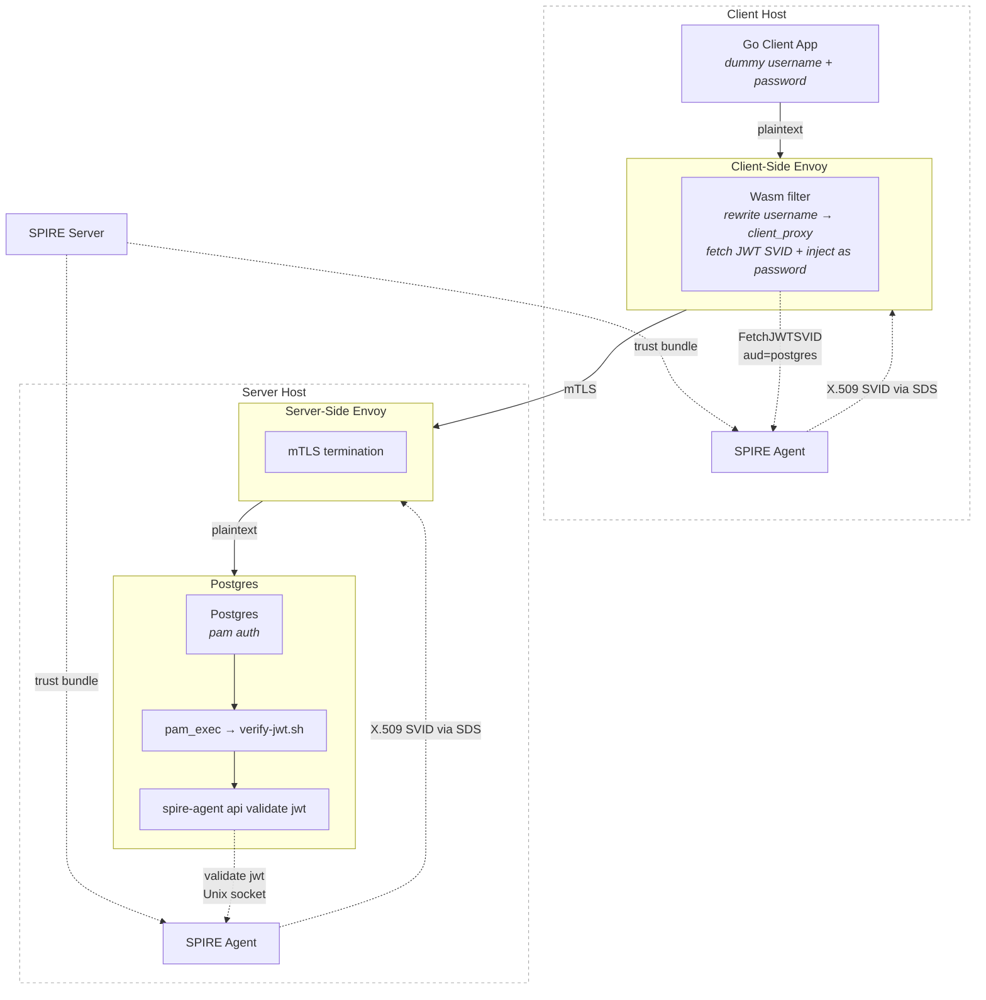
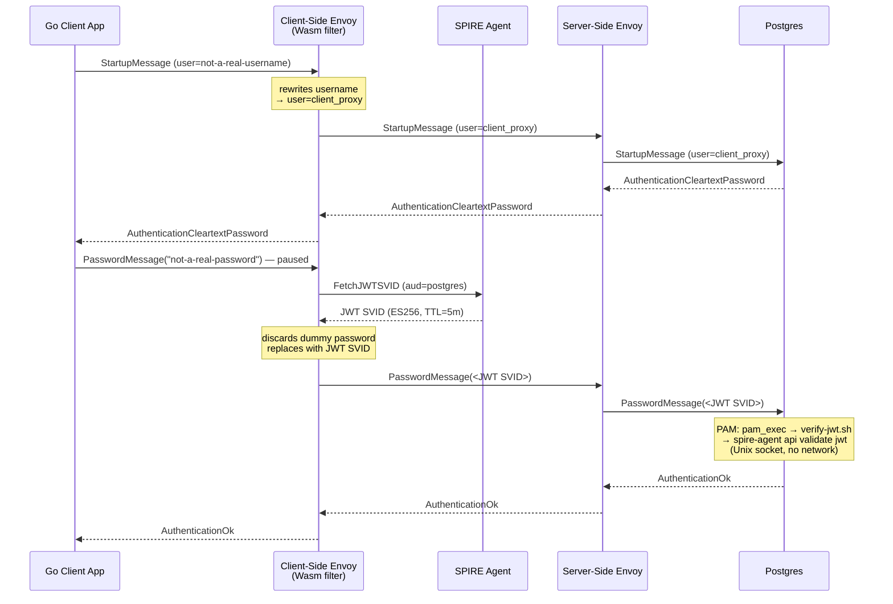

# Postgres SPIFFE Auth Example

## About

This example demonstrates transparent mTLS proxying between a Go application and a Postgres
cluster using SPIFFE/SPIRE for workload identity — without any SPIFFE awareness in the application
itself. The Go client connects with `sslmode=disable` and a dummy username and password. Two Envoy sidecar proxies
handle the mTLS tunnel, mutual identity verification using X.509 SVIDs, and — via a Wasm network
filter — JWT SVID fetch from SPIRE, username rewriting, and credential injection into the
Postgres authentication exchange, all transparently on behalf of the application.

This contrasts with the [Cassandra example](../cassandra/), where the Go application is
SPIFFE-aware and explicitly fetches its SVID to perform mTLS.

The example uses Docker Compose to create a bridge network and attach the following containers:

- [SPIRE Server + Agent](./spire/)
- [Client-side Envoy sidecar](./envoy/client-config.yml)
- [Server-side Envoy sidecar](./envoy/server-config.yml)
- [Custom Postgres instance](./postgres-custom/) (includes `spire-agent` binary for PAM JWT validation)
- [Golang client application](./client-go/)

## Architecture

The client-side Envoy Wasm filter rewrites the Postgres `StartupMessage` username to the
normalized SPIFFE ID path (`client_proxy`, derived from
`spiffe://demo.trust.geico/client-proxy`), then fetches a JWT SVID from the SPIRE Agent and
injects it as the password — the application is completely unaware of either operation. The
server-side Envoy terminates mTLS and forwards plaintext to Postgres, which validates the JWT
via `pam_exec` → `verify-jwt.sh` → `spire-agent api validate jwt` over a local Unix socket
(zero network calls, trust bundle cached by the SPIRE Agent).

## How it works: username rewrite, JWT fetch, and PAM validation

The client's original password is discarded — the Wasm filter fully replaces
the `PasswordMessage` buffer with the JWT before it reaches the server. PAM validates both the
JWT's cryptographic integrity and that its subject matches the connecting username.

## Comparison with the Cassandra example

| Aspect | Cassandra | Postgres |
|---|---|---|
| SPIFFE awareness | App fetches SVID and performs mTLS | App has zero SPIFFE awareness |
| Envoy instances | 1 (server-side only) | 2 (client sidecar + server sidecar) |
| TLS origination | Go app (`tls.Config`) | Client-side Envoy (SDS) |
| SVID types used | X.509 SVID (mTLS) | X.509 SVID (mTLS) + JWT SVID (app-layer identity) |
| Credential source | App provides credentials directly | Wasm filter rewrites username + injects JWT SVID |
| Server-side auth | Cassandra native auth | PAM → `spire-agent api validate jwt` |
| Go dependencies | `gocql`, `go-spiffe` | `lib/pq` only |

## Usage

- `bash start` — build the Wasm filter binary and the custom Postgres image, then bring up the full stack.
- `bash verify` — check app logs, Wasm filter logs, and PAM auth.
- `bash stop` — tear down all containers and volumes.
